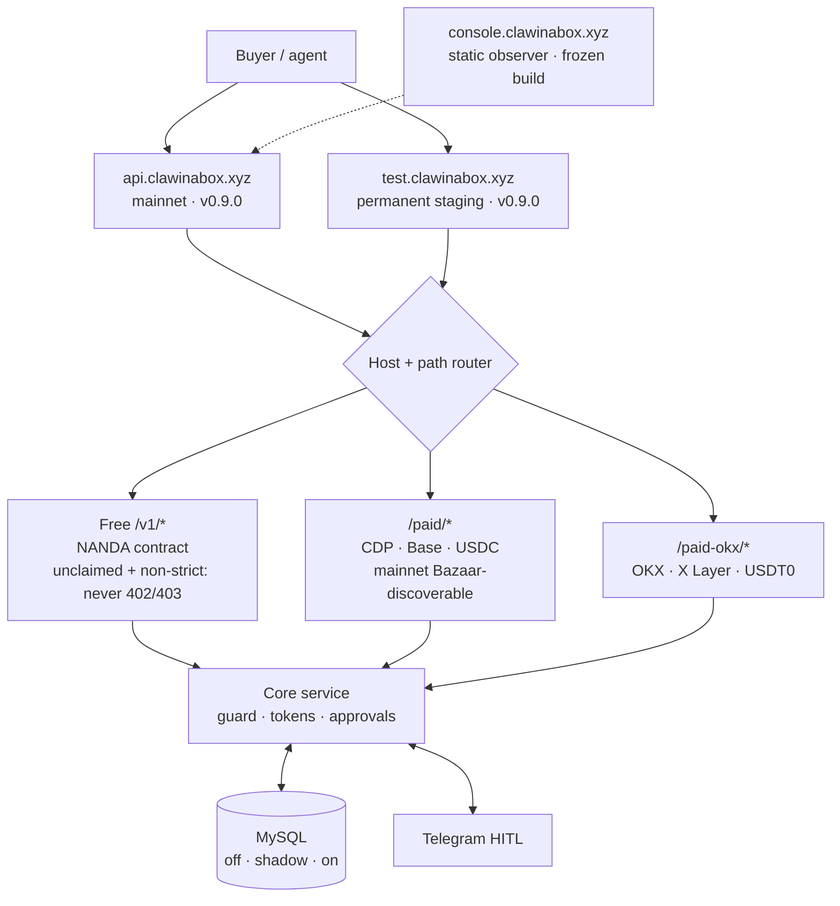
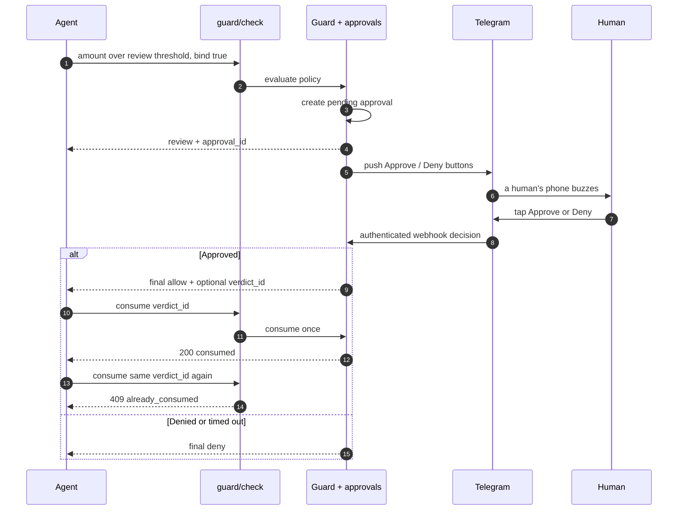
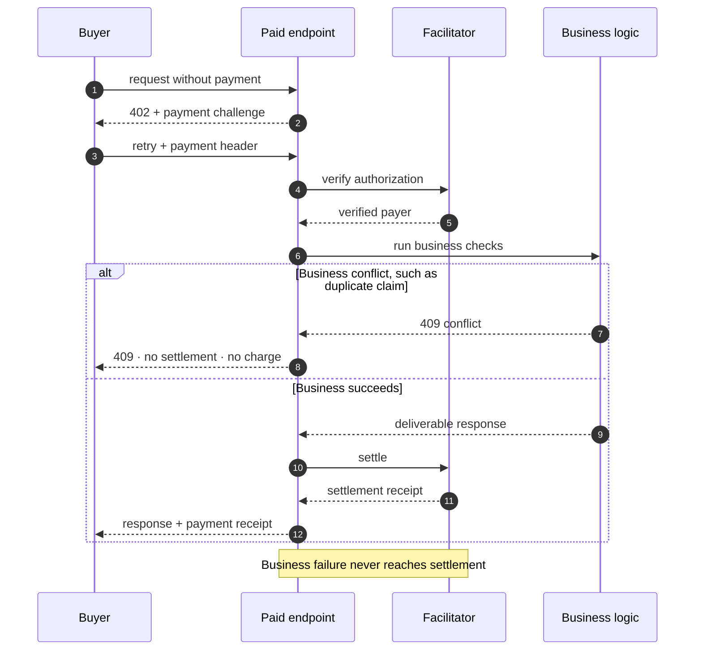
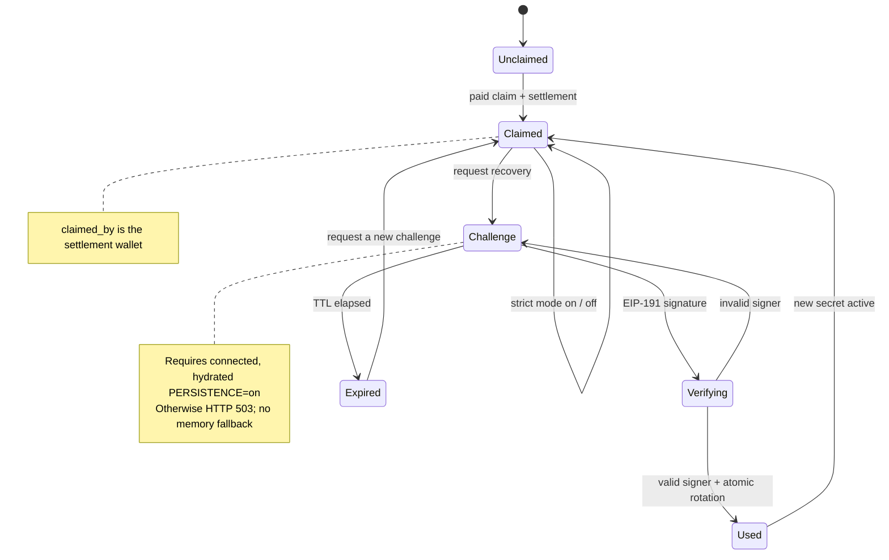
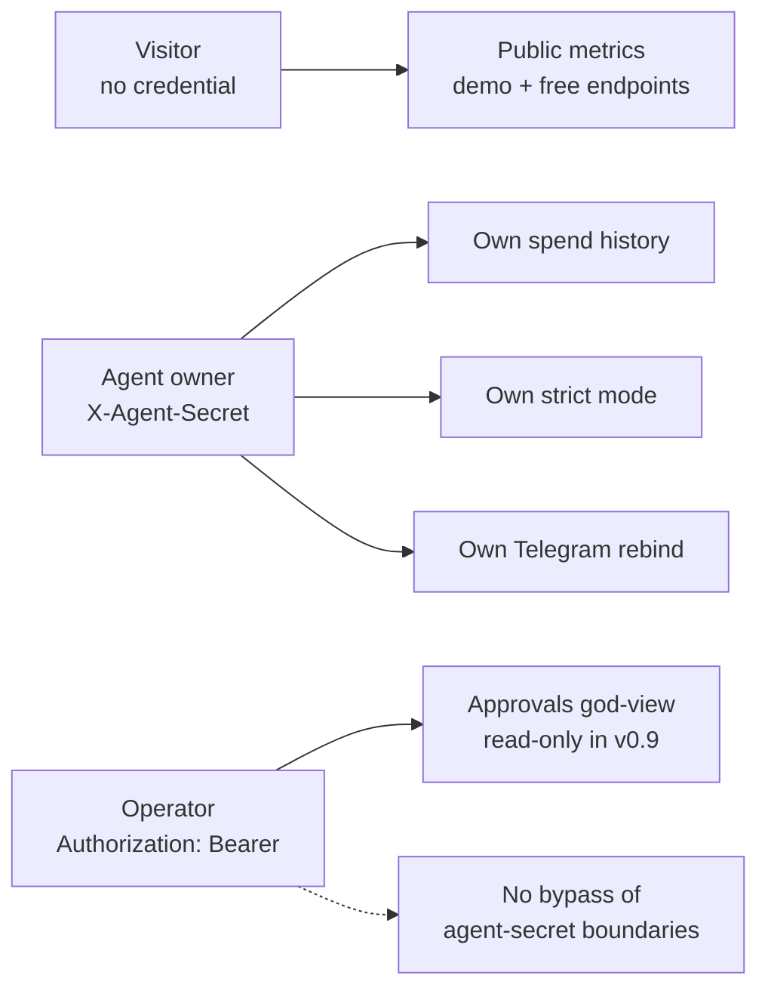
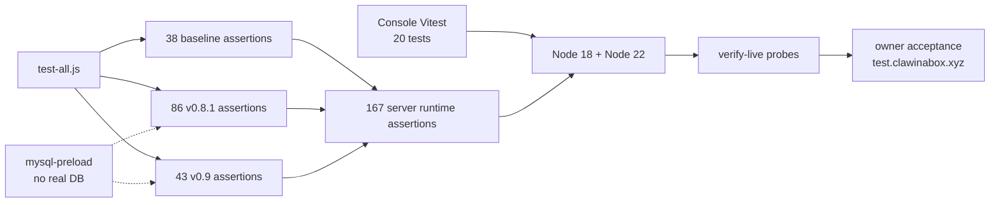
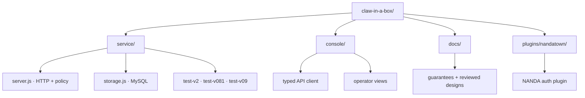

# Claw-in-a-Box 🦞📦

**Your agent asks before it spends.** Bounded authorization for AI agents:
your agent is the claw — it can grab, spend, and act. Claw-in-a-Box is the box:
it limits what the claw can reach, how much it can spend, and for how long,
with a human pull cord for high-risk actions.

Claw-in-a-Box is the human-approval layer for AI agent commerce. It combines
deterministic spend-policy verdicts, attenuating capability tokens, Telegram
human-in-the-loop approvals, and two production x402 payment rails in one API.

## Live surfaces and marketplace listings

Project home: **https://clawinabox.xyz** · Live API:
**https://api.clawinabox.xyz** ([`/healthz`](https://api.clawinabox.xyz/healthz))
· Agent-facing API reference: [`service/SKILL.md`](service/SKILL.md)
([live copy](https://api.clawinabox.xyz/skill.md))

**Live surfaces:** mainnet [api.clawinabox.xyz](https://api.clawinabox.xyz)
(v0.9.0) · permanent staging
[test.clawinabox.xyz](https://test.clawinabox.xyz) (v0.9.0) · Console
[console.clawinabox.xyz](https://console.clawinabox.xyz) (frozen contest build).

Marketplace listings:

- [Claw-in-a-Box on OKX.AI](https://www.okx.ai/agents/5854) — USDT0 on X Layer through the official OKX x402 SDK
- [Claw-in-a-Box on Agentic.Market](https://agentic.market/services/api-clawinabox-xyz) — USDC on Base through the Coinbase/x402 Bazaar rail

## System architecture



The Console observes and operates through declared HTTP APIs; the service—not
the UI—enforces identity, policy, persistence, payment, and human decisions.

## Claw Console

[`console/`](https://github.com/ckeda/claw-in-a-box/tree/agent/console-build-week/console)
contains the public, browser-only operator workbench for the live service.
It visualizes live service health,
guard verdicts, Telegram approvals, token delegation trees, binding, and policy
presets while a typed safety layer prevents any paid-route request.

The Console is an independently deployable static SPA. Its visitor tools need
no key; v0.9 agent-owner and operator views are enforced by the service's new
read/recovery APIs. See its
[`README`](https://github.com/ckeda/claw-in-a-box/blob/agent/console-build-week/console/README.md)
for local setup, tests, and operational notes.

## What it does

### Spend-policy verdicts

Before spending, an agent calls `POST /v1/guard/check` with an amount,
destination, and either a preset or inline policy. The service returns
`allow`, `review`, or `deny`, plus the exact rules and reasons that fired.

The policy engine supports per-transaction caps, daily cumulative budgets,
destination allowlists, human-review thresholds, and time windows. The free
route is part of the public NANDA contract and never requires payment.

### Telegram human approval

A `review` verdict creates a short-lived approval and sends Approve/Deny
buttons to a human in Telegram. Callers can poll the approval or wait for its
resolution, and operators can bind their own Telegram chat through a one-time
`/bind CODE` flow.

This is the signature live-demo path:



### Delegatable capability tokens

An agent can mint a root token and delegate narrower children or grandchildren.
Every hop can only reduce scopes, shorten lifetime, and bind to one audience.
Revoking an ancestor invalidates its entire descendant tree.

### Paid x402 mirrors

The same authorization engine is available for $0.01 per delivered call on two
payment rails:

- `/paid-okx/*` uses the OKX x402 envelope and X Layer/USDT0.
- `/paid/*` on `api.clawinabox.xyz` uses Base/USDC and publishes Bazaar discovery metadata.

Free `/v1/*` endpoints remain outside both payment middlewares. Business
failures are checked before settlement so callers are not charged for rejected
requests.



### Restart-safe persistence

v0.8.0 adds an optional MySQL layer with three rollout modes:

- `PERSISTENCE=off` — v0.7 behavior; no database path is loaded.
- `PERSISTENCE=shadow` — memory stays authoritative while mutations are dual-written asynchronously.
- `PERSISTENCE=on` — shadow writes plus boot-time hydration of revocations, daily spend, operator bindings, and pending approvals.

Database failures degrade to in-memory operation and appear in `/healthz`;
they do not block ordinary requests. Multi-replica coordination is not yet a
guarantee because memory remains the runtime source of truth.

### Pay-to-Claim identity and execution binding

v0.8.1 adds a paid-only identity bootstrap. `POST /paid/v1/agents/claim`
(or its `/paid-okx` mirror) settles $0.01, records the facilitator-verified
payer wallet, and returns a 256-bit `agent_secret` exactly once. Only its
SHA-256 hash is stored. Claimed agents must present `X-Agent-Secret` for
operator registration, rotation, and `POST /v1/agents/strict`; strict agents
also require it on guard checks on both free and paid rails. All three identity
mutations fail closed unless the database is connected and hydrated in
`PERSISTENCE=on` mode. The 201 claim response reports the verified payer
provisionally; settlement payer is the durable `claimed_by` ground truth, with
any mismatch surfaced through audit and `/healthz`.

Callers that need a decision bound to one execution send `"bind": true` to
the guard. An allowed decision—or a review later approved by a human—returns a
short-lived `verdict_id`, consumed once at `POST /v1/verdicts/:id/consume`.
Pending verdicts survive a single-instance restart and re-arm their remaining
expiry. Unconsumed verdicts expire and refund their same-day ledger charge,
including expiry during downtime. Audit events persist the claim, binding,
approval, verdict, mismatch, and revocation lifecycle.



### Authenticated operational views and wallet recovery

v0.9.0 adds three server-enforced Console roles. Visitors can read public,
aggregate-only `GET /v1/metrics`. An agent owner presents that agent's
`X-Agent-Secret` to read current spend plus PII-minimized v0.9-forward history
at `GET /v1/agents/:id/spend`. The single operator bearer key gates the
approximately 30-minute god-view at `GET /v1/approvals`; it grants no mutation
and cannot bypass agent-owner checks.

Claim-wallet recovery uses a five-minute, domain-bound EIP-191 challenge at
`POST /v1/agents/recover`. Nonces are stored only as hashes and consumed once
in the same transaction that rotates the secret. v0.9 supports EOA wallets;
contract and custodial claimers require manual operator recovery. All three
new reads and recovery fail closed unless `PERSISTENCE=on` is connected and
hydrated. In the Console, the operator key is sessionStorage/in-memory only;
the lower-scope agent secret may be stored in localStorage.



The operator credential exposes the cross-agent approval list, but it is not a
superuser token: it cannot read an owner's spend or perform owner mutations.

## Honest guarantees

### One idea, three enforcement surfaces

The design thesis of this project is that *bounded authorization* — a grant
that can only shrink as it moves, and dies with its ancestors — is one
abstraction that should be enforced wherever an agent acts, at whatever
guarantee strength that surface supports:

| surface | instance | guarantee grade |
|---|---|---|
| HTTP service | this repo's token + guard API | gateway-enforced |
| agent-protocol simulation | [NANDA Town](https://github.com/projnanda/nandatown) `auth: delegatable` plugin ([`plugins/nandatown/`](plugins/nandatown/)) | gateway-enforced, adversarially validated |
| on-chain smart accounts | session-key constraint compiler (roadmap) | protocol-enforced |

The same policy primitives can be carried across these surfaces; what changes
is who enforces them. That distinction is spelled out honestly in
[`docs/guarantees.md`](docs/guarantees.md): a gateway can refuse to bless an
action, but only a protocol can make the action impossible.

## Quickstart

Call the hosted free API without an account:

```bash
BASE=https://api.clawinabox.xyz

curl -s -X POST "$BASE/v1/guard/check" \
  -d '{"agent_id":"my-agent","amount":30}'

ROOT=$(curl -s -X POST "$BASE/v1/tokens" \
  -d '{"subject":"boss","scopes":["read","write","pay"]}' | jq -r .token)

curl -s -X POST "$BASE/v1/tokens/delegate" \
  -d "{\"parent_token\":\"$ROOT\",\"audience\":\"worker\",\"scopes\":[\"read\"],\"ttl_seconds\":600}"
```

Full endpoint shapes, policy schemas, error codes, payment behavior, and
recommended agent patterns are documented in [`service/SKILL.md`](service/SKILL.md).

## Self-hosting and tests

Node.js 18 or newer is required. The production dependency graph deliberately
pins `jose` v5 through `overrides` for Node 18 CommonJS compatibility.

```bash
cd service
npm ci
GUARD_SECRET=$(openssl rand -hex 32) PORT=8787 npm start
```

Persistence is off by default. To enable it, configure `DB_HOST`, `DB_PORT`,
`DB_USER`, `DB_PASSWORD`, and `DB_NAME`, then select `PERSISTENCE=shadow` or
`PERSISTENCE=on` according to the rollout plan.

Run the complete local suite from `service/`:

```bash
npm test
```

The release gate runs the suite on Node 18 and Node 22. Server deployment also
requires staging acceptance and live invariant verification; a passing local
suite is necessary but never sufficient for mainnet promotion.



There are 158 named server test call sites and 167 runtime assertions because
nine v0.8.1 assertions execute through shared loops. Runtime output is the
judge-reproducible headline.

## Roadmap

| Version | Theme | Exact status |
|---|---|---|
| v0.7.5 | Production service | **Historical mainnet release**; superseded by v0.9.0 |
| [v0.8.0](https://github.com/ckeda/claw-in-a-box/tree/v0.8.0) | Memory | **Merged; persistence live on mainnet**; tag `v0.8.0` |
| [v0.8.1](https://github.com/ckeda/claw-in-a-box/pull/2) | Locks | **Merged (PR #2); live on mainnet — Pay-to-Claim serving real settlements** |
| [v0.9.0](https://github.com/ckeda/claw-in-a-box/pull/3) | Face | **Merged (PR #3); live on mainnet and permanent staging** |
| v1.0.0 | Promise | **In progress** — frozen `/v1` contract, public guarantees, and deprecation policy |
| v1.1.0 | Probe | **Planned** — trading-policy and MCP discovery experiments with written kill criteria |

See [`CHANGELOG.md`](CHANGELOG.md) for shipped changes and version dates.

## Repository history and layout

Production service sources live in `service/`; `plugins/nandatown/` contains
the NANDA protocol integration, `docs/` records guarantee boundaries, and the
browser Console lives in `console/`. Versions v0.2.0–v0.7.5 shipped as
reviewed deployment artifacts during a rapid NANDA → OKX.AI → x402 Bazaar
sprint rather than as repository commits; their release history and the return
to this repository at v0.8.0 are recorded in [`CHANGELOG.md`](CHANGELOG.md).

```text
service/
  server.js           production HTTP service
  storage.js          optional MySQL persistence
  landing.js          API landing page template
  status.js           status page and probes
  SKILL.md            agent-facing API documentation
  test-v2.js          38-check baseline suite across six boot modes
  test-v081.js        v0.8.1 security, payment, audit, and restart suite
  test-v09.js         v0.9 reads, recovery, rate/CORS, and fail-closed suite
  package.json        deployable service manifest
  package-lock.json   locked Node 18-compatible dependency graph
plugins/nandatown/    NANDA auth plugin, validators, scenario, and tests
docs/guarantees.md    enforcement guarantees and honest boundaries
docs/v0.9.0-design.md reviewed Face API, data, threat, and Console design
CHANGELOG.md          release history, including artifact-only versions
llms.txt              root-site machine-readable project summary
console/              static operator Console
```



## License

Apache-2.0.
